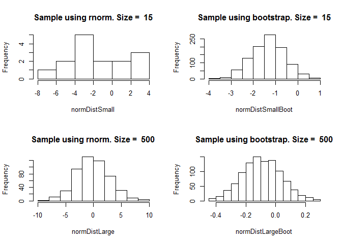
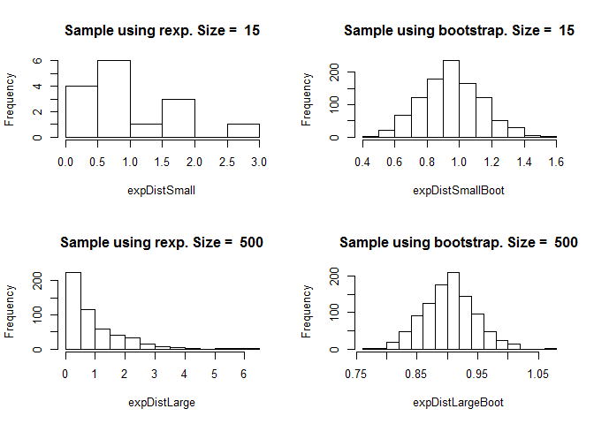

# Central Limit Theorem
Jack Imburgia  
October 20, 2016  


## Central Limit Theorem

This code will demonstrate the Central Limit Theorem using R and bootstrap.

The Central Limit Theorem states that "given certain conditions, the arithmetic mean of a sufficiently large number of iterates of independent random variables, each with a well-defined (finite) expected value and finite variance, will be approximately normally distributed, regardless of the underlying distribution."
(https://en.wikipedia.org/wiki/Central_limit_theorem)

### Set up
Create the vectors that store small and large sample sizes for both normally and exponentially distributed data,

```r
# Define what small and large sample sizes are for this exercise
smallSampleSize <- 15
largeSampleSize <- 500

# Using rnorm, create small and large normally distributed vectors
normDistSmall <- rnorm(smallSampleSize, 0, 3)
normDistLarge <- rnorm(largeSampleSize, 0, 3)

# Using rexp, create small and large exponentially distributed vectors
expDistSmall <- rexp(smallSampleSize)
expDistLarge <- rexp(largeSampleSize)
```

### Performing the bootstrap
From the normally distributed data we will sample the data and capture the bootstrap mean.

```r
sampleSizeBoot <- 1000 # size of the bootstrap vector

# Create the vectors to store the bootstrapped samples
normDistSmallBoot <- numeric(sampleSizeBoot)
normDistLargeBoot <- numeric(sampleSizeBoot)

expDistSmallBoot <- numeric(sampleSizeBoot)
expDistLargeBoot <- numeric(sampleSizeBoot)

# Perform and populate the bootstrap vectors
for(i in 1:sampleSizeBoot){
  # Pull samples from the normally and exponential distributions
  normDistSmallSample <- sample(normDistSmall, size=length(normDistSmall), replace=TRUE)
  normDistLargeSample <- sample(normDistLarge, size=length(normDistLarge), replace=TRUE)
  
  expDistSmallSample <- sample(expDistSmall, size=length(expDistSmall), replace=TRUE)
  expDistLargeSample <- sample(expDistLarge, size=length(expDistLarge), replace=TRUE)
  
  # Calculate the means for the bootstrap samples
  normDistSmallBoot[i] <- mean(normDistSmallSample)
  normDistLargeBoot[i] <- mean(normDistLargeSample)
  
  expDistSmallBoot[i] <- mean(expDistSmallSample)
  expDistLargeBoot[i] <- mean(expDistLargeSample)
}
```

### Normally distributed data - Before and After
The histograms demonstrate that after the bootstrap the data appears to be normally distributed for the small sample size and moreso for the large sample.

```r
par(mfrow=c(2,2))
# Show the small normally distributed data pre and post bootstrap
hist(normDistSmall, main = paste("Sample using rnorm. Size = ", smallSampleSize, sep = " "))
hist(normDistSmallBoot, main = paste("Sample using bootstrap. Size = ", smallSampleSize, sep = " "))

# Show the large normally distributed data pre and post bootstrap
hist(normDistLarge, main = paste("Sample using rnorm. Size = ", largeSampleSize, sep = " "))
hist(normDistLargeBoot, main = paste("Sample using bootstrap. Size = ", largeSampleSize, sep = " "))
```

<!-- -->

### Exponentially distributed data - Before and After
The histograms demonstrate the results of the bootstrap very clearly as the exponential distribution is not normal at all and is normal after the bootstrap.

```r
par(mfrow=c(2,2))
# Show the small exponentially distributed data pre and post bootstrap
hist(expDistSmall, main = paste("Sample using rexp. Size = ", smallSampleSize, sep = " "))
hist(expDistSmallBoot, main = paste("Sample using bootstrap. Size = ", smallSampleSize, sep = " "))

# Show the large exponentially distributed data pre and post bootstrap
hist(expDistLarge, main = paste("Sample using rexp. Size = ", largeSampleSize, sep = " "))
hist(expDistLargeBoot, main = paste("Sample using bootstrap. Size = ", largeSampleSize, sep = " "))
```

<!-- -->
